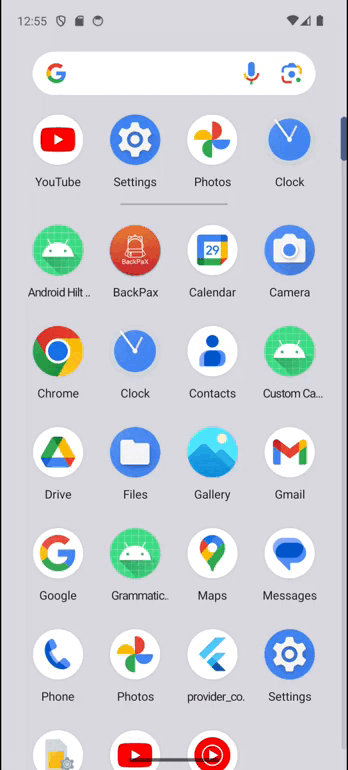

# Flutter Provider-Consumer Reusable Sample

Sample project about use of Flutter Provider and Consumer with Bottom Navigation Bar.

## Table of contents
- [Flutter Support](#flutter-support)
- [Demo](#demo)
- [Features](#features)
- [Getting started](#getting-started)
- [Usage](#usage)
- [Methods](#methods)
- [Want to Contribute?](#want-to-contribute)
- [Need Help / Support?](#need-help)
- [Collection of Components](#collection-of-components)
- [Changelog](#changelog)
- [License](#license)
- [Keywords](#keywords)

## Flutter Support

Flutter Version - Flutter 3.13.9

Android Studio Giraffe | 2022.3.1 Patch 4

## Demo

## Features

* Flutter Provider and Consumer with Bottom Navigation Bar sample project.

## Getting started

* Download this sample project and run in your Android Studio.
* Update UI based on your requirements.

## Usage

Setup process is described below.

### Methods

Package

        provider: ^6.1.1

Create ChangeNotifier class.

        class MyProvider extends ChangeNotifier{

            int selectedTab = 0;

            void selectedPage(int index){
                selectedTab = index;
                notifyListeners();
            }
        }   

Wrap root widget within ChangeNotifierProvider.

        @override
        Widget build(BuildContext context) {
            return ChangeNotifierProvider(
            create: (context) => MyProvider(),
            child: MaterialApp()
        }

Wrap the widget which you want to rebuild within Consumer widget

     Consumer<MyProvider>(
        builder: (context, provider, child) => BottomNavigationBar())

## Want to Contribute?

* Created something awesome, made this code better, added some functionality, or whatever (this is the hardest part).
* [Fork it](http://help.github.com/forking/).
* Create new branch to contribute your changes.
* Commit all your changes to your branch.
* Submit a [pull request](http://help.github.com/pull-requests/).

## Collection of Components
We have built many other components and free resources for software development in various programming languages. Kindly click here to view our [Free Resources for Software Development.](https://www.weblineindia.com/software-development-resources.html)

## Changelog
Detailed changes for each release are documented in [CHANGELOG](./CHANGELOG).

## License
[MIT](LICENSE)

[mit]: ./LICENSE

## Keywords
Flutter Provider, Flutter Consumer, State Management